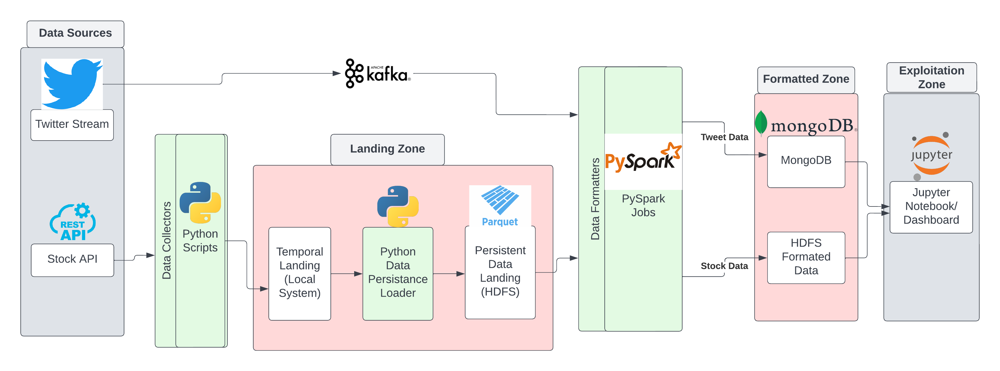
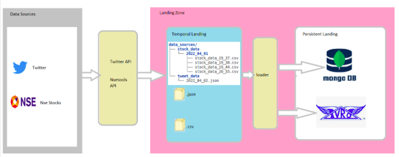

# Big Data Pipeline (Sense Stock)
The project aims to build a big data pipeline for our business idea Stock sense where we Aimed to provide stock data along with social media data in order to help in the invetment providing better sense to investment. The detailed Idea can be seen here - 
[Stock Sense Slides](src/VBP_PRESENTATION.pdf)

To install the requirments run
```
pip install -r requirments.txt
```

The Whole Pipeline Developement will be done in Three Phases -
<br><br>

# Big Data Pipeline

The high level view of the pipeline is indicated below -




As indicated in the above pipleine, we have two data sources, first one is the twitter stream and the second one is the stock market API. We are collecting tweet stream data in mongoDB after processing at the end for exploitation zone and integrated visualization.  


## 1. Setup Data Sources 
<br>

**1. Twitter API** 

Setup The twitter developer account to access the API keys, It Can be done from [create deverloper account](https://developer.twitter.com/en/docs/twitter-api/getting-started/getting-access-to-the-twitter-api)

Detailed Video - [How to setup Tweet](https://www.youtube.com/watch?v=Lu1nskBkPJU)
<br/>

**2. Stock API**

clone the repo and place the nsetools in **src/local_collector** \
in our code we have already placed it. 
```
https://github.com/vsjha18/nsetools
```
nsetools - provides the real-time stock market data for National Stock Exchange, India.
Further details can be found here - [nsedocs](https://nsetools.readthedocs.io/en/latest/) 

<br />

**3. Companies List**

We used the top 25 companies listed here in [NSE Top 100](https://www.moneycontrol.com/stocks/marketinfo/marketcap/nse/index.html)
We have provided the csv file with top 25 companies listed for NSE.


## 2. Twitter Stream

### **A. Setup Kafka server and MongoDB**

**I. Kafka Server**

1. start zookeeper server on one terminal
```#zookeper default port 2181
BDM_Software/kafka_2.13-3.1.0/bin/zookeeper-server-start.sh BDM_Software/kafka_2.13-3.1.0/config/zookeeper.properties
```

2. start kafka server on another terminal
```# kafka default port 2181
BDM_Software/kafka_2.13-3.1.0/bin/kafka-server-start.sh BDM_Software/kafka_2.13-3.1.0/config/server.properties
```


3. create a topic twitter if not created
```
BDM_Software/kafka_2.13-3.1.0/bin/kafka-topics.sh --create --topic twitter --bootstrap-server localhost:9092
```


**II. MongoDB Server**

1. Open tmux session in detached mode and keep running mongoDB server on backend
```
BDM_Software/mongodb/bin/mongod --bind_ip_all --dbpath /home/bdm/BDM_Software/data/mongodb_data/
```
**The above servers can be run on tmux sessions as well to keep them running - [Tmux](https://tmuxcheatsheet.com/)**

<br>

### **B. Start twitter Stream**
From sense_stock folder run -

1. run kafka producer
```
python3 src/stream_collector/kafka_producer.py
```

2. Run Spark Pipeline
```
python3 src/stream_collector/spark_processing.py
```

## 2. Stock Makrket API

We run the stock extraction files in VM using crontab in unix environment, which execute the file every day accordint to pattern. [Crontab](https://crontab.guru/)

Below are the instruction to setup. Simply type 
```
crontab -e 
```
to edit the file in any mode (nano,vim,etc)

```

* * * * * python3 /home/bdm/sense_stock/src/local_collector/st_load_local.py >> /home/bdm/logs/local_logs.log
* * * * * python3 /home/bdm/sense_stock/src/db_collector/st_load_parquet.py >> /home/bdm/logs/parquet_logs.log
```

**Note** :
1. we also have aggregation over data using RDDs for each hour which can be run everyhour using the following command

```
0 * * * * python3 /home/bdm/sense_stock/src/db_collector/spark_rdd_aggregation.py >> /home/bdm/logs/parquet_logs.log
```

## 3. Visualization

Once the twitter stream and stock data insertion started the jupyter notebook can be run **visualization.ipynb**

1. It will display each minute tweets
2. And each minutes stock prices

**Any granulrities can be adapted when scalling the project**


# ---------------------------------------------------------

# Phase 1 (Project P1)

The high level view of Phase one data pipeline is indicated below - 


<br>


<br><br>

## 2. Setup Data Collectors (DataBases/File Systems)

We are using the Database presented in Virtual Machine provided by UPC on cloud Systems. So the Databases are already setted up in VM. We are using the following Databases in our pipeline.

## A. HDFS 

To start server on VM use
```
/home/bdm/BDM_Software/hadoop/sbin/start-dfs.sh
``` 

## B. MongoDB 

a. modify the libcurl package using the below commands
```
sudo apt-get remove libcurl4
sudo apt-get install libcurl3
```
b. Open tmux session in detached mode and keep running mongoDB server on backend
```
tmux new -s mongodb
BDM_Software/mongodb/bin/mongod --bind_ip_all --dbpath /home/bdm/BDM_Software/data/mongodb_data/
```
more on tmux session - [Tmux](https://tmuxcheatsheet.com/)

<br><br>

## 3. Running Instructions 
**1. clone the repo**
```
git clone https://github.com/himanshudce/sense-stock-bdm
```
<br>

**2. run the below files to get the data locally**

a. For tweets (place your API keys)
```
python3 tw_load_local.py
```
** for ease, I have provided my API keys for tweets
<br>

b. For Stock data
```
python3 st_load_local.py
```

**After loading it will give the following file structure**


**3. Load data in mongo and hdfs**

a. To load tweet data in mongo
```
python3 tw_load_mongo.py
```

b. To load stock data in hdfs
```
python3 st_load_hdfs.py
```


## Note

The above files run automatically for each day when stock market gets open from 9 to 4 IST(Indian Standart time, tz = Asia/Kolkata) 

We run these files in VM using crontab in unix environment, which execute the file every day accordint to pattern. [Crontab](https://crontab.guru/)

Below are the instruction to setup. Simply type 
```
crontab -e 
```
to edit the file in any mode (nano,vim,etc)

```
0 4-11 * * * python3 /home/bdm/tw_load_local.py >> /home/bdm/logs/tw_logs.log;
0 12 * * * python3 /home/bdm/tw_load_mongo.py >> /home/bdm/logs/tw_mongo_logs.log;
*/1 4-11 * * * python3 /home/bdm/st_load_local.py >> /home/bdm/logs/st_local_logs.log;
0 12 * * * python3 /home/bdm/st_load_hdfs.py >> /home/bdm/logs/st_hdfs_logs.log
```
